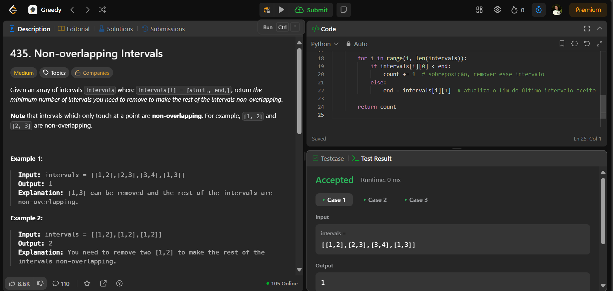

# 435. Non-overlapping Intervals

O arquivo [LC435.py](.GreedLeetCode_Questoes/LC435.py) apresenta a resolução do exercício número 435 sobre greedy algorithms da plataforma LeetCode.

A resolução foi aceita pela plataforma, conforme a **Figura 1** abaixo:

**Figura 1** - Resolução da questão 435.

## Explicação da solução

1. O algoritmo ordena os intervalos com base no tempo de término (`end`) de cada intervalo.

2. Inicializa duas variáveis:
   - `count` para contar quantos intervalos precisam ser removidos.
   - `end` com o valor de término do primeiro intervalo.

3. Itera pelos intervalos a partir do segundo (índice 1):

    3.1. Compara o início do intervalo atual com `end`.

4. Se o início (`start`) do intervalo atual for menor que `end`:

    4.1. Existe sobreposição dai incrementa `count`, pois este intervalo deve ser removido.

5. Caso contrário:

    5.1. Atualiza `end` com o término do intervalo atual, pois ele será mantido.

Saída: Após a iteração, retorna `count`, o número mínimo de intervalos a serem removidos para que não haja sobreposição ou conflito.
