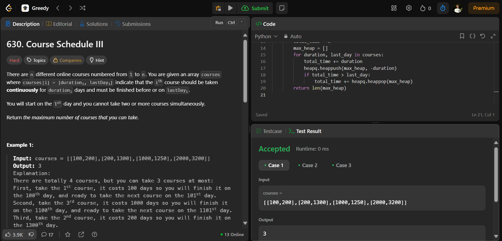

# 630. Smallest Range Covering Elements from K Lists

O arquivo [LC630.py](./LC630.py) apresenta a resolução do exercício número 630 sobre greedy algorithms da plataforma LeetCode.

A resolução foi aceita pela plataforma, conforme a **Figura 1** abaixo:

**Figura 1** - Resolução da questão 630.

## Explicação da solução

## Explicação da solução

1. O algoritmo ordena os cursos com base na data limite (`last_day`) de cada curso.

2. Inicializa duas variáveis:
   - `total_time` para acumular o tempo total gasto em cursos.
   - `max_heap` para armazenar durações dos cursos cursados (como heap máximo).

3. Itera por cada curso na ordem da data limite:

    3.1. Adiciona a duração do curso ao `total_time`.

    3.2. Insere a duração do curso no `max_heap`.

4. Se `total_time` exceder a data limite (`last_day`) do curso atual:

    4.1. Remove o curso com maior duração do `max_heap` para reduzir o tempo total.

    4.2. Atualiza `total_time` subtraindo a duração removida.

Saída: Ao final, o tamanho do `max_heap` representa o número máximo de cursos que podem ser concluídos sem ultrapassar os prazos.
